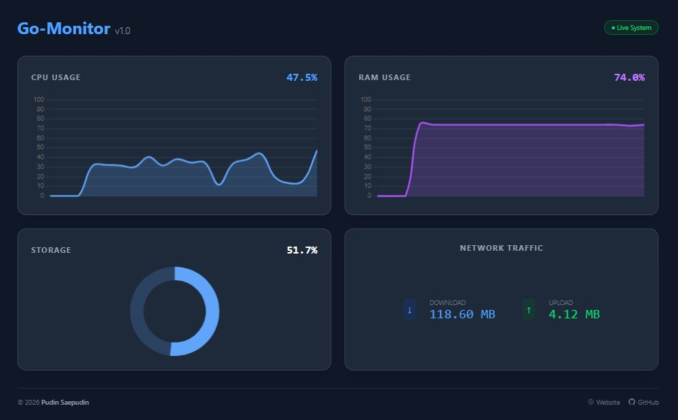

# APLIKASI MONITORING SEDERHANA

## Tampilan Aplikasi



## MENJALANKAN DENGAN GOLANG
Pertama
```
go mod tidy
```
Selanjutnya
```
go run cmd/main.go
```
Buka Browser
```
http://localhost:8086
```

## LANGSUNG MENGGUNAKAN DOCKER
Buat file:
docker-compose.yml

Masukan Script ini
```
services:
  app:
    image: pudinalazhar/go-monitor:latest
    container_name: go-monitor
    ports:
      - "8086:8086"
    volumes:
      - ./data_db:/app/db  # File sqlite akan tersimpan di folder 'data_db' di host
    restart: unless-stopped
    environment:
      - GIN_MODE=release
```

Aktifkan
```
docker compose up -d
```

Build No Cache
```
sudo docker compose build --no-cache && docker compose up -d
```

Log Monitoring
```
docker logs -f go-monitor
```

Cara Update
```
docker-compose pull  && docker-compose up -d
```

## Binnary dan Systemd di linux
Silahkan cek pada file systemd.md

### Pudin Saepudin
- https://italazhar.com
- https://github.com/pudintea
- https://t.me/pudin_ira
- https://hub.docker.com/r/pudinalazhar